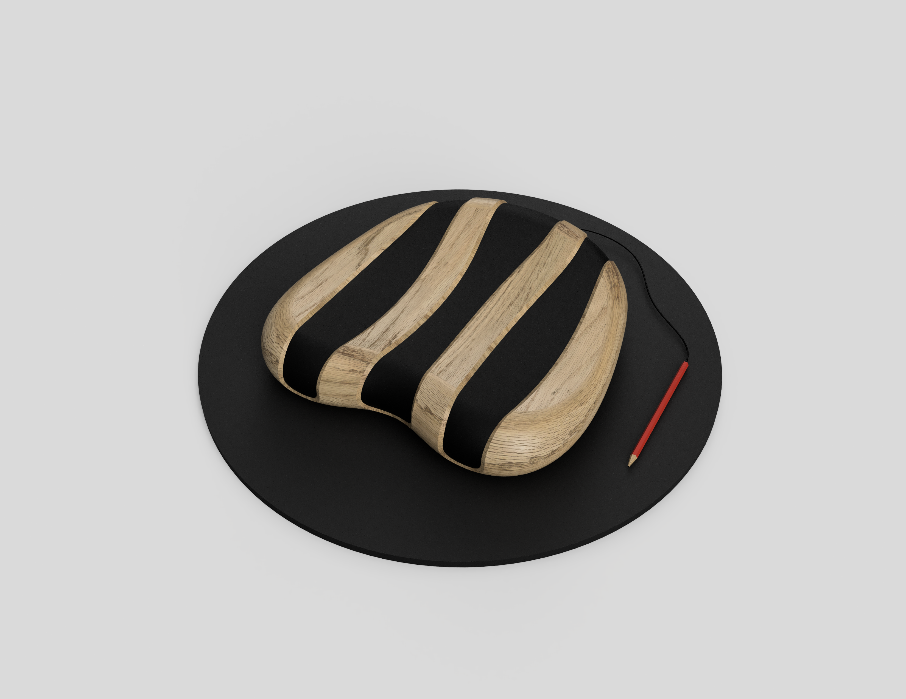

# Future of Drawing

Github repository documenting process and code of the *Atelier Media Design 2023* at HEAD in which we explored possible Futures of Drawing in collaboration with Caran d'Ache.

[Overview of all projects of the class](https://github.com/HEAD-MasterMediaDesign/head-md-future-of-drawing)

## Shortcut Links

1. [Process Logs](process)  
   Logs every one or two working days
2. [To-Do-List](process/To-Do-List.md)  
   Current Tasks
3. [Presentations](presentations)  
   PDFs of all presentations did during the development process
4. [Form](form)  
   3D Renderings, Shape / Material experimentation
5. [Sound](sound)  
   Sound experimentations
6. [Electronics](electronics)  
   Arduino / Electronic diagrams and code
7. 

## Project Desription

**Resonance** -  Finding the inner balance through the movement of drawing

In the contemplative drawing experience Resonance people are  
encouraged to pause, slow down and enter a state of reso-  
nance - physically within the installation as well as metaphori-  
cally with themselves.

The core of the installation forms a novel interpretation of a  
sound bowl, crafted from wood and graphite. By engaging in  
slow rhythmic pencil movements on the object, people can set  
suspended pendulums in the space into gentle motion, creating  
contemplative soundscapes.

The rich electromagnetic properties of graphite are used to  
sense the rhythmic movement, allowing the pendulum to re-  
spond only when individuals move in resonance.

