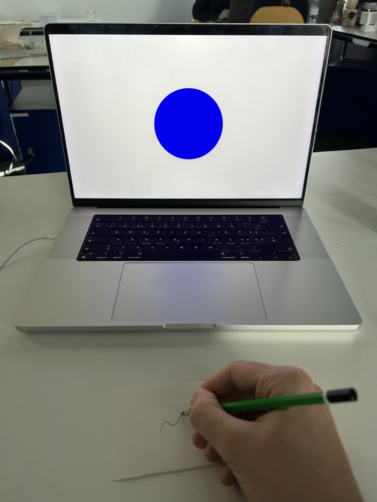
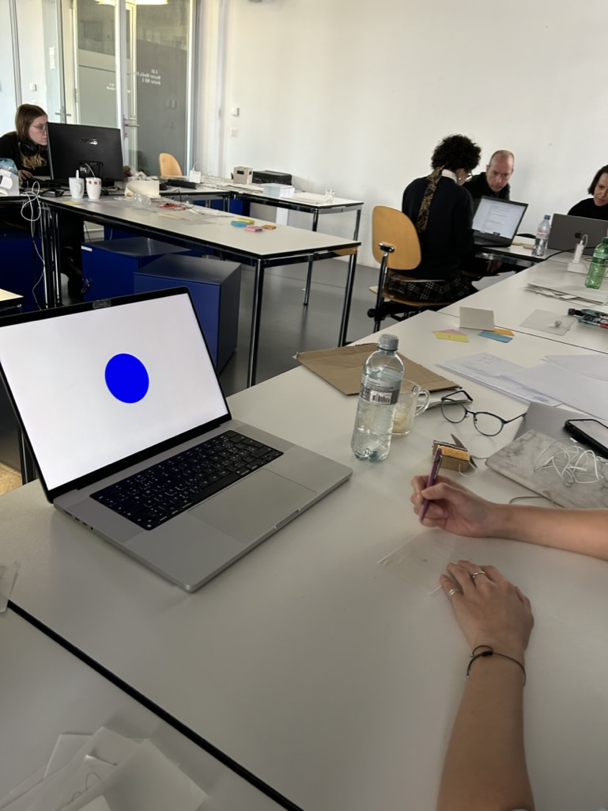
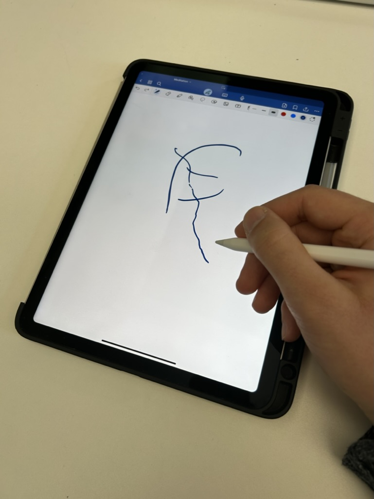
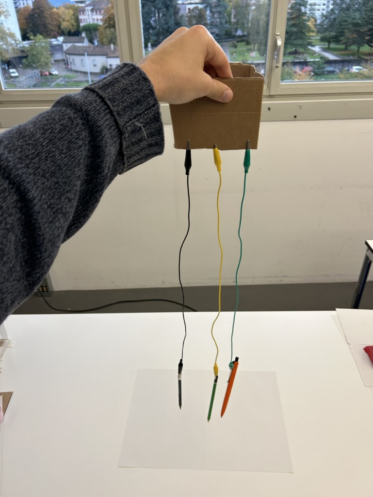

# 2023-11-01 Process Log

Today I went on with my two previous ideas and did more experiments.

## 1 breath = 1 drawing
**Traces of breath**

Based on the first idea of having one drawing per breath and creating a medidative drawing experience I did some experiments with people of our class.

### Setup

Screen with slowly pulsing circle or headphone sound which set the rythm of inhaling and exhaling. 

After every breath cycle the participants get a new small piece of paper or a new white page on the ipad screen for their next drawing.

Instruction: It doesn't matter what you draw it's just important to focus on your breath and go with the flow. 

Very simple p5.js Code for the pulsing circle:

```
function setup() {
  createCanvas(800, 800);
}

function draw() {
  fill(220,220,220, 255);
  rect(0,0, width, height)
  noStroke()
  fill("blue")
  circle(width/2, height/2, map(sin(frameCount * 0.0075), -1,1, 300, 500));
}

function mousePressed() {
  fullscreen(true);
}

function windowResized() {
  resizeCanvas(windowWidth, windowHeight);
}
```

   
    
Link to the audio with the guided breathing meditation  
https://www.youtube.com/watch?v=N0tY-TaEEQI


### Findings

- Calming / Relaxing experience
- People stop thinking about the drawing and get into a flow
- Drawing can help to prevent thoughts while meditating, but it can also draw away attention from the breathing
- natural to make one drawing movement for inhaling (often going up) and another drawing movement for exhaling (often going down)
- easier / more natural with eyes closed
- everbody does abstract movement

#### Experimentation Pictures





## Pencil Conductivity

I found an interesting video from ElectroBoom on YouTube:  
https://youtu.be/5YBwDNfOaxU?si=ej5ED4wHxOc74gEq

The video showcases the electric conductivity of graphite (material of which pencil leads are made of). With graphite you can build potentiometers and make strokes and flames (graphite is even used in nuclear plants) or just use it as a simple conductor. I came up with the idea of connecting a pencil with a resistance sensor that can measure the electrical properties of your drawing while you create it and transforms this information into another medium. (e.g. sound, visuals, etc.)

Inspired by the video I tried to measure the electrical conductivity of pencil lines on paper. Unfortunately this only worked half. I only got measurable resistance if the line was done with a lot of pressure on the paper but not with a normally drawn line. 

However I found out online that harder pencils might work better. And appereantly you can build experimental instruments just from your drawings. 

https://makeymakey.com/blogs/how-to-instructions/sketch-it-play-it


#### Experimentation Pictures




## Feeback Meeting

**Idea 1 in 1 sentence:** Interactive meditative drawing experience in which one breath equals one drawing. 

**Idea 1 in 1 sentence:** Interactive experience making use of the astonishing superpowers of graphite.

**Interest idea 1:** personal interest in meditation

**Interest idea 2:** graphite superpower material, you can do every magic with it you can also do with electricity


**Feedback Meditation Idea:**
- Dont go down the the general mediation rabbit hole with mindfulness and similar stuff. Very whitewashed, commercialised practice. Even meditation apps. Very western. Find another angle to it. 
- If I do mediation focus more on the drawing and what it makes with the drawing.

**Feedback Superpower-Material Graphite**
- Play with the analouge properties of graphite. Don't try to make digital on off signals out of it like makey makey. 
- Keyword analouge infinite richness
- Different lenghts of pencils different characteristics

**Connecting the two ideas**

Being in the body with the help of graphite. 
Graphite has like analogue quality and richness to it and is similar to breathing.

Interesting reference (plays with the analogue properties)
https://www.waterlightgraffiti.com/about-wlg/

If I want I can still create an artificial breathing based on the drawing. 

Look out for things / habits that ground people. (doesnt have to be breath, can be ice water, elastic band, running, etc. )

Creating a feedback loop  
draw and measure at the same time, connected circuit with body (maybe tiny electroshocks?)

Make people be in their body, or not at all with the help of graphite.

draw to sync with your body 
