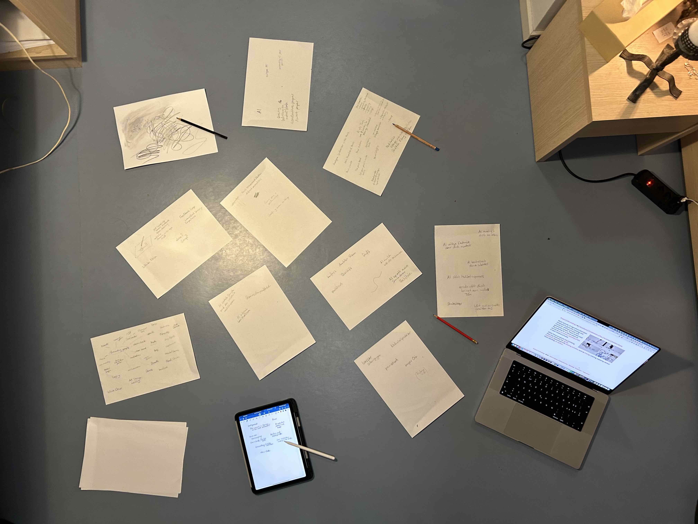
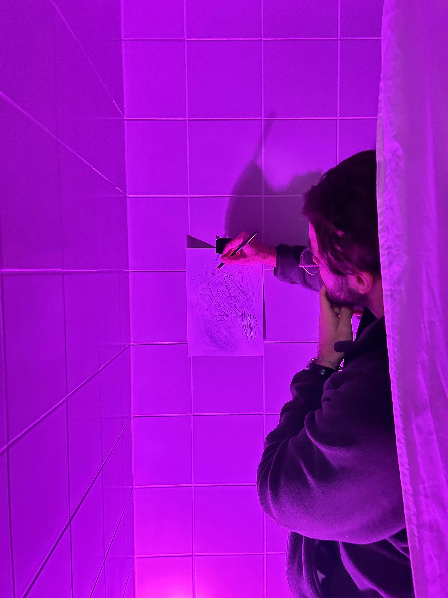
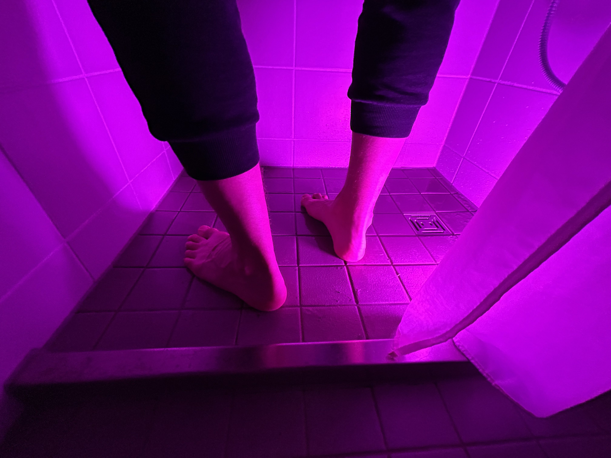

# Deliverables

## Concept Pitch

The project creates a multisensory contemplative drawing experience in which the electromagnetic traces of graphite are used to create a meditative, slowly pulsating painting of sound that gradually evolves in co-creation with an AI. The experience starts in a puristic setting of a dark room which floor is covered by water and only features a pencil hanging down from the ceiling and a blank canvas on the wall. Visitors have to enter barefoot and alone. Inspired by the slow rhythm of meditative breathing as well as the analogue richness of graphite, a pulsating and looping spheric soundscape starts to form as soon as the person begins drawing. Every drawn line contributes a sound to the evolving live loop while the AI is altering the past patterns with time. Visitors are encouraged to go with the flow as the emphasis shifts to the mental impacts of the act of drawing while the specific content of drawings becomes irrelevant.

The concept idea draws from my research on mental grounding and meditation as well as my research on the hidden superpowers of graphite.

Idea Brainstorming Session

## Research Key Insights

Pictures from latest prototype testings with flatmates.

### Research on mental grounding and meditation

Quote from psychologytoday.com:

> Whenever you find yourself feeling anxious or stressed, you can use grounding techniques to reconnect with yourself and the present moment. This research-based strategy may be helpful for anxiety, panic attacks, flashbacks, or even dissociation.
> Grounding techniques work by “grounding” you in the present moment and pulling you away from intrusive thoughts or feelings. This refers not only to having your “feet on the ground” but also your “mind on the ground.” When you turn your attention away from thoughts, memories, or worries, you can refocus on the present moment (Fisher, 1999).

Grounding can help many people cope with their mental challenges. Grounding techniques are manyfold and and can include the following or more:

refresh with ice water, cold shower, bath, scents, music, white noise, running, snapping rubber band, touching specific objects, yoga/stretching, mental math arithmetics, small electro shock, laughing, meditation, slow breathing, sexuality, nature, mud, walking barefoot, pets, mental games, doing art,dancing, ...

I did experiments with people to try out grounding techniques. The first experiment was a more classic meditative experiment where people listened to breathing instructions and had to draw something with every breath. It was interesting to observe that after little time people started drawing abstract and focusing more on the movement than the drawn figure itself. The movement also helped them not to wander off with their thoughts while meditating.
For the installation I want to think more broadly about the topic of grounding and not only about meditation. However I found this slow rhythm of the breathing very interesting and want to build further on that.

In the second expirment, inspired by the current vision for the installation I asked flatmates to stand barefoot onto the wet floor of the shower and draw to a slowly pulsating sound and colored light. The combination of light, sound and water made for an enchanting experience even if not very long lived. After around 2 minutes it started to get uninteresting, but this could also be attributed to the fact that the drawing experience was not yet interactive and the sounds were static.

### Research about superpowers of graphite
The more I researched about the material graphite (which pencils leads are made of), the more fascinated I've got. Graphite is a superpower material that is used for a lot of different use cases. Here is a non comprehensive list what can all be done with graphite:

- Electric Arcs / Strokes / Flames
- Melt metal, even steel
- Diamagnetic Floating
- Conductivity
- Potentiometers
- Batteries
- Nuclear Plants: Moderator / shielding material
- can be turned into diamonds under pressure and high temperatures

Graphite has the interesting property, that the the electrical resistance of it changes based on the length or thickness of the material. Because of this property graphite is used in potentiometers which are at the heart of a myriad of analogue and digital input devices.

The fact that graphite is not only conductive but allows for continous changing of its electric properties, adds an analogue richness to the material that is interesting to be explored by sound. Ultimately a connection to analogue synthesizers can be drawn: Analogue synthesizers use reactive electronic components to create rich and warm sounds incorporating graphite potentiometeres as their main input and interaction technique.

Example video of using pencil graphite to modulate the brightness of an LED  
https://www.youtube.com/watch?v=aElHVTv-75M

In addition to the electromagnetic properties of graphite, there are more properties of the pencil that might be interesting to be explored in a sonic way.

- Hardness
- Density
- Length
- Pressure
- Flexibility
- Friction

## User Journey

1. Visitor enters dark room. There is only a dim pulsating light on the pencil which catches the visitors attention.
2. Visitor wants to try out that pencil, but doesn't want to get wet shoes and therefore decides to go barefoot.
3. Visitor tries out first strokes and perceives sonoric interactivity.
4. Visitor continues drawing and exploring.
5. As the lights and sound in the room are pulsating visitor starts to draw and also breathe in that rhythm.
6. Visitor perceives AI changements to the former sounds.
7. Slowly sound and light gains momentum.
8. After about ten minutes sounds are calming down.
9. Visitor slowly leaves the room and feels grounded in the best case.

## Tentative conclusions

### Next steps

Some technical questionmarks whether measuring works in that form as envisioned. Needs technical testing.

Do more user tests with more functional prototypes. Do experiments including interactive sound.

Feedback Sound Loop
