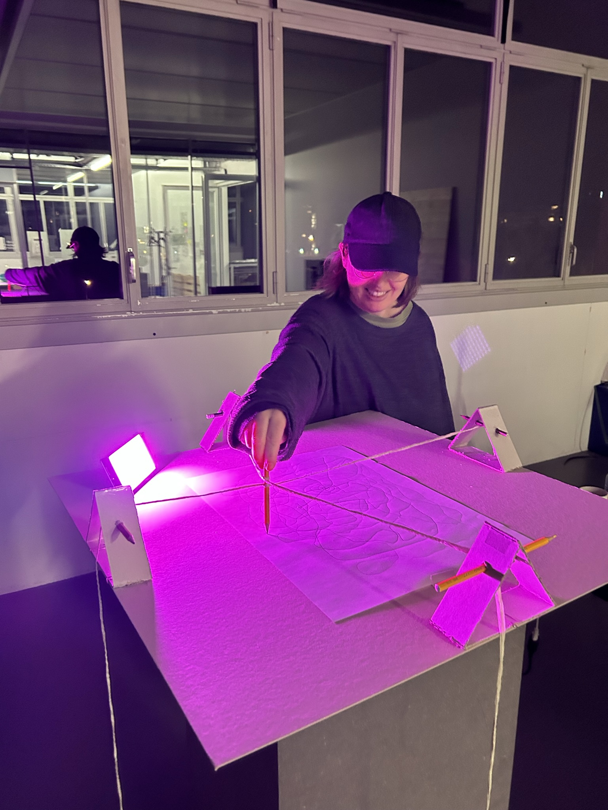

# 2023-11-14 Process Log

I was not yet so happy with my concept and did a more research today and discussed the ideas with different persons.

My main problem was the following
“The more I add technological stuff the more it takes me away from being grounded ”

## Notes from discussion with Pablo

- There is nothing preventing you from being grounded if you do a simple interaction
- maybe also think of binaural sound via headphones instead of a big room setting
- do an simple satisfactory interaction that can help people relax and feel grounded  
  -> First goal: Relaxing people -> might eventually lead to being grounded
- finding inner balance through gesture of drawing
- constraining the movement you can do with a pencil might be interesting.
- #satisfaction: Inspired by wholesome videos that can help people relax
- Zen-like experience
- maybe draw in sand or graphite sand
- why do I want to use sound? -> it's an important aspect in relaxing people, immediate mental response
- feel good.
- also important to find sound references for the presentation

## New experiments

### Testing

People not only interact with the pencil directly but also try to pull on the ropes and draw indirectly over the mechanism.
Because of the big size of the object will probably also try to interact together with it.

I don't really want this indirect manipulation as it draws people away from what should be the focus. Maybe the ropes and stones have to be inside the table (behind a plexiglas) to not let people interact directly.

Through the constraints people are less likely to do figurative drawing, however they are strongly influenced about what has already been drawn. Ideally you wouldn't see a drawing on the paper and it would totally covered by graphite. Or you write on a metal plate.

## Updated Pitch

The project creates a multisensory contemplative drawing experience, with the goal of relaxing and centering / grounding people. They interact with an mechanical drawing object that at the same time gives constraints and sparks satisfaction through movement. While drawing, electromagnetic measurements of the graphite scratching on the the surface are measured and transformed into sounds that are altered by an AI to create looping spheric relaxing sounds. The installation creates a feedback loop in which the person influences the soundscape through their drawing movements while at the same time the sound influences their drawing.

There is an feedback loop between the object doing sound influencing the person and the person changing the sounds.

 you draw to create sounds while at the same time being influenced by the sonic expeirence and the Ai

In this manner a feedback loop is created

sparks satisfaction

designed to give constraint

an satisfactory experience

 an assists people in their groudning process. 

The pepople interact with an 

The drawing device is designed to makee people mre focus on the movemtents and have a visual feedback of the 

 make the the experience more satisfactory. 

cons

visitors interact with an satisfactory object while an AI creates sounds 

AI creates a sound that lets the come into resonance with their boday 

helping people to ground themselves and relax

helping people to find inner balance / center themselves / 

I wanted to design an object or experience that grounds people through the action of drawing.

There is an feedback loop between the object doing sound influencing the person and the person changing the sounds.

Where is the AI?

Finding resonance, findoing something that resonates with people

in the best case they get so focussed that they enter a meditative zone

binarual sound headphones

The project creates a multisensory wholesome / relaxing / contemplative drawing experience.

What is the title?

What is the core idea?

The project creates a multisensory contemplative drawing experience in which the electromagnetic traces of graphite are used to create a meditative, slowly pulsating painting of sound that gradually evolves in co-creation with an AI. The experience starts in a puristic setting of a dark room which floor is covered by water and only features a pencil hanging down from the ceiling and a blank canvas on the wall. Visitors have to enter barefoot and alone. Inspired by the slow rhythm of meditative breathing as well as the analogue richness of graphite, a pulsating and looping spheric soundscape starts to form as soon as the person begins drawing. Every drawn line contributes a sound to the evolving live loop while the AI is altering the past patterns with time. Visitors are encouraged to go with the flow as the emphasis shifts to the mental impacts of the act of drawing while the specific content of drawings becomes irrelevant.

Presentation peparation

- Go straight to the core of your project
- In interaction design you can not fake it last minute, you need to take your time and constantly test

This project is a ...

go straight to the point
put sentence of the end to the beginning.

help peole feel grounded

User Journey,

put pictures / vidoes of research / tests.

very simple shape research

if you have insights / discoveries from field reseach put those discoveries.

User tests: What worked?

go to very essence!

The testers expected…

First image: sketch, hand drawn.

Sound inspo
https://www.youtube.com/watch?v=8V71sATDTqs
https://www.youtube.com/watch?v=6BM-7oG1W6Y

## User Journey

1. Visitor gets curious about that special object.   

out of curiosity user wants to try out object 

User recognizes sound reactivity 

2. Visitor starts drawing with pencil and recognizes sound and watches rocks going up and down.
3. Visitor puts on headpohones and
4. 

is attracted by object and starts to try it ot

experiment of sound, graphite and metal (& movement)

pencil graphite loop

what gives it to me?

need an information

music is guiding me 
not enough guided

im getting into the flow
being out of sync

you have to get into their groove to get into your groove (like with a cat)

harmonics resonace is an interesting concept to be furter explored. Through drawing finding your resonance

rez game

can be honest about stuff Im not happy about yet, don't have to sell

its missng a conclusion, so what?

replace paper, put metal plate or dark paper. 

It need some kind of feedback, maybe get more into resonance 

talk shortly about voltage pencil experiment.

in the experiment

Is it more than just fun? Oh that's nice? What should stick?

It is an 

## Presentation notes

I was focussed on intensified sensory drawing experience and grounding people. as well as graphite 

talk about grounding research