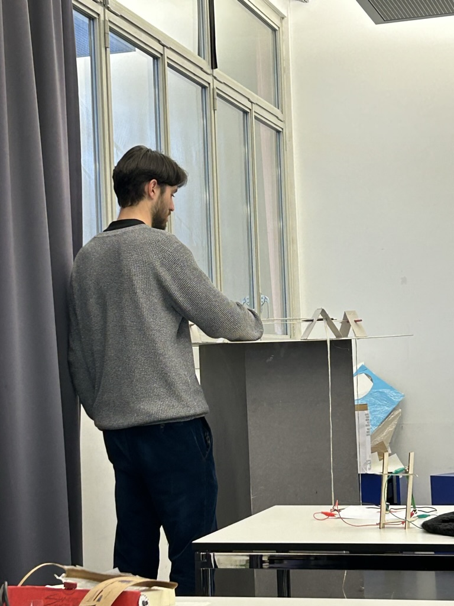

# 2023-11-16 Process Log

Today was the big presentation day to show our current state of the work to Caran d'Ache. Sophie from the marketing departement of Caran d'Ache was present and gave us feedback on our projects. 
My presentation can be found in the folder [presentations](/presentations/).

## Official Feedback after presentation

- Can you find an physic response to the drawing in addition to the sound?
- Positive feedback from Laure about the form of the object
- Could the machine also directly be an instrument? Could the things moving up and down generate the sound?
- Look into people doing gong experimentations, a lot of videos online.

## Other feedback
- one persone thinks the current project still kinda looks like a torture machine (you torture the pencil for your own well-being)
- another person pereceives the apparatus more as a sculpture that would be interesting to look at while it moves independently. More inviting to look at than to interact by yourself. 

## Observation

During the day I observed many people of our class independently walking to the prototype and trying it out just out of curiosity. There definitely seems to be some appeal or attraction to the object.

  
Spotted people randomly trying out object

## Log / Reflection

I felt quite stressed the days before the presentation. Tuesday evening I had bit of a existential crisis with the project. But after an discussion with pablo I found a way to move forward. The new idea and prototype I came up with is not perfect and I had quite a critical feedback with Alexia and Douglas on Wednesday evening. However there are some interesting things about it even though I will have to refine / rethink a lot. I accepted that this is a work and progress and not the most elaborate idea yet. The presentation went well and I am now much more relaxed afterwards. The general feedback from Douglas and Alexia after the presentations was reassuring. In the evening I had a discussion with Douglas that helped a lot with the understanding of the project and imagination of next steps.

## Feedback with Douglas after classes

- Quite contradictory feedback: Very critical feedback from Douglas & Alexia on wednesday evening. Good feedback from Sophie from Caran d'Ache and good feedback from Laure. 
- Douglas relativated Alexias critique, especially as there was also positive feedback today. I definitely don't have to throw away the new object, but still also have to explore pure graphite interactions without the new object. 
- It's okay when the topic of grounding also evolves, for example change into something like "floating". 
- It's totally okey if there is no AI inside it. 
- Douglas / Alexia are pushing us to simplify things to really get to the core of the interaction. But it doesnt have to stop there. Once we have that core we will add recomplexify later in the process.
- Thinking the object as an instrument doesn't mean its only mechanical. There is also a world of physical digital soundmaking. Douglas showed very interesting reference projects of the german artist Moritz Simon Geist, see below. 

## Reference Projects of Moritz Simon Geist

Vibrations  
https://www.youtube.com/watch?v=F_h4LO-8Uxg

Feature Ring  
https://www.youtube.com/watch?v=lduN5rsHovI

Sonic Robots  
https://vimeo.com/sonicrobots

