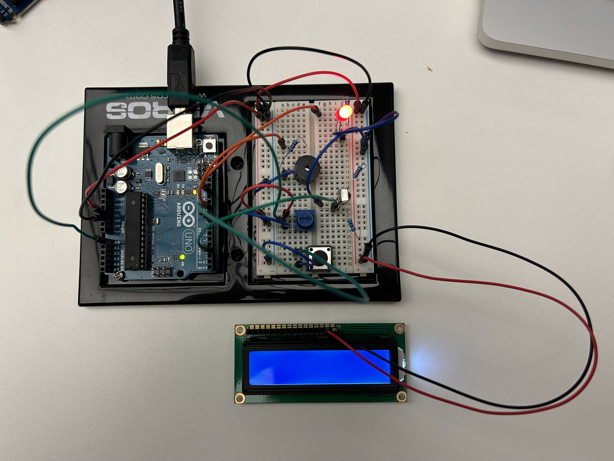

# 2023-11-16 Process

## Electronics

In the last three days we had the electronics introduction with Pierre Rossel. We learned the basics of electronic circuits and arduino programming. After the obligatory basic examples of the first two days (dimming LEDs, potentiometer input, piezo, etc.) I started with my first own electronic experimentations today.

  
Organized cable chaos on my breadboard

Firstly I tried out different components of my arduino starter kit. I had an remote control and an infrared receiver and got them working together with the help of an downloaded online library. I made an setup in which I can remotely turn an LED on or off. Next I looked into the details how to get an display working. However as there is a lot of wiring up required (over 12 pins for my LCD display) I stopped with this endavour for time reasons. But at least I generally know how to do it in case I will need it.

**Video**  
[Video of LED Remote Control](IMG_0301.mov)

I wanted to move to doing actual experimentation that is related to my concept. After some wiring and tweaking I've got a resistance measurement on my pencil working. With this setup I am able to draw on a metal plate and it gives me the resistance value of the graphite which depends on the pressure. As a next step I created a TouchDesigner sketch to read the serial value and try around a bit with different signal processing options, e.g. applying lookup tables, filters, or lags. I achieved a setup in which I can control the brightness of my laptop screen just by changing the pressure with the pencil. The next step will be to use this improved clean signal to try to generate sounds. I started watching Max Msp Tutorial for synthesizer sound creations. With this setup I will hopefully soon be ready to do more user tests.

