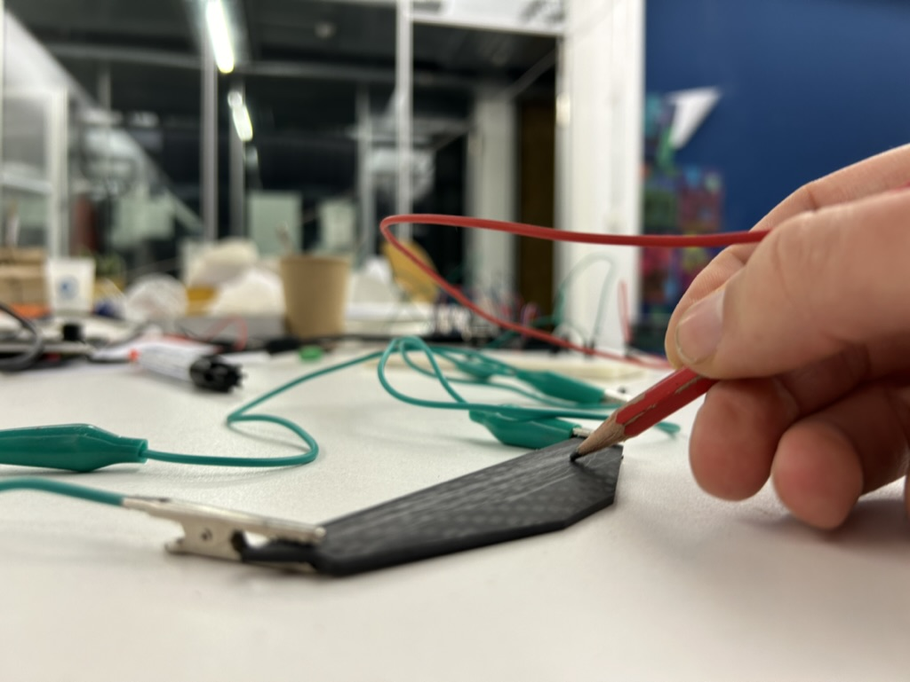

## 2023-12-12 Process

Today I continued working on the circuit design and data processing.

To calculate the different values of the circuit I hat to do a lot of mathematics. Together with Pierre we found an 6 terms equation system for 6 unknowns that we solved together. 

I found out that now matter how much I tried I couldnt get the carbon fiber plate working to get usable values. I will have to switch to just using an wood plate with pencil graphite on it. 

I tried to reserve an appointment in the wood atelier but failed because they were in a hurry and had no time.

Carbon fiber plate unfortunately not working. 

-> Picture
