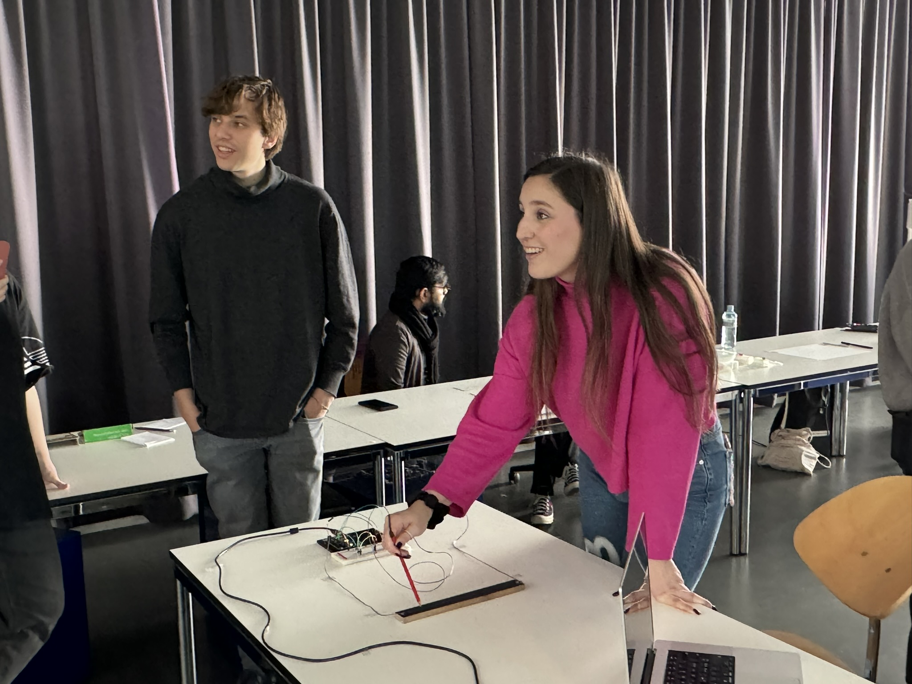
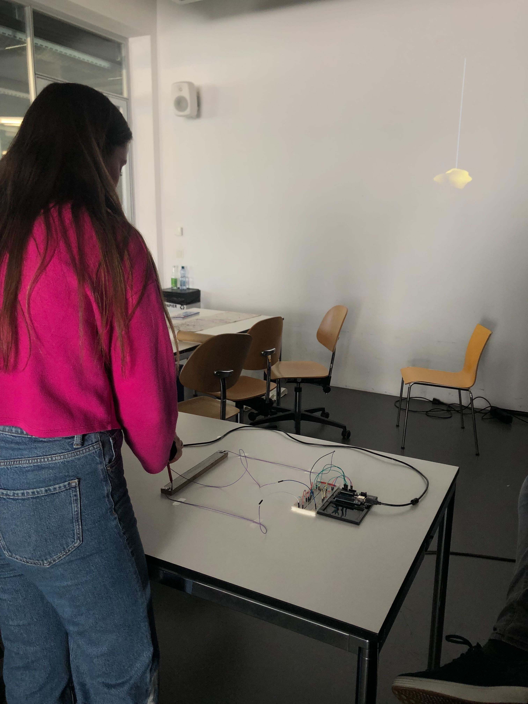
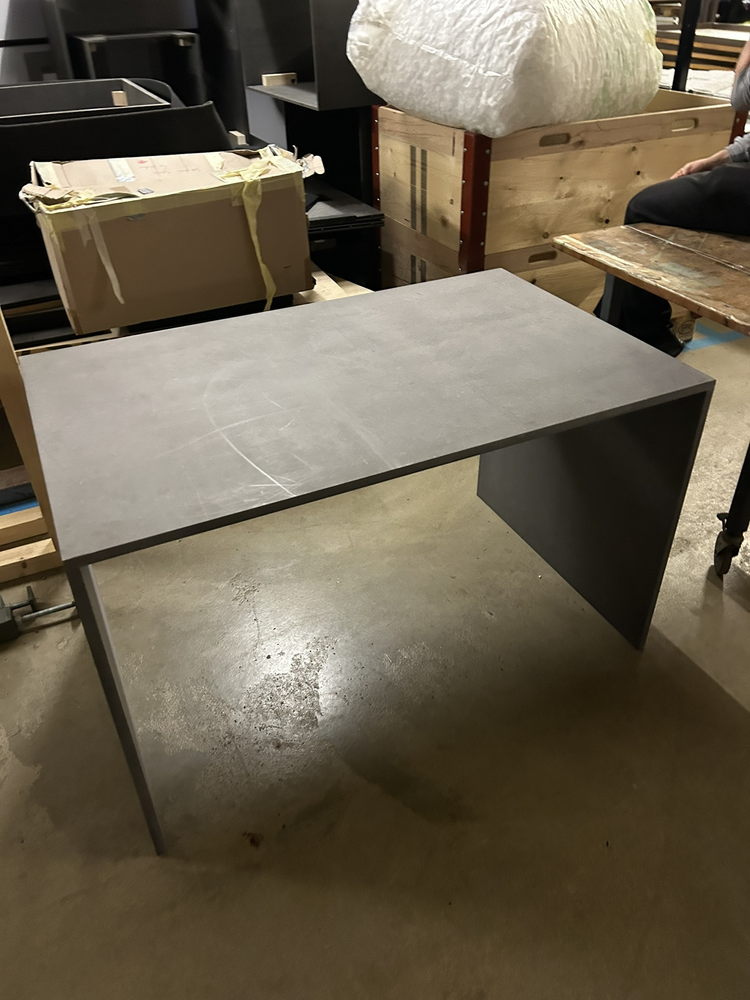

# 2023-12-14 Testing Day

## General objective

Test the quality of the resonance interaction (rhythmic pencil movements to get floating object oscillating).

## Testing setup

I prepared a first coded prototype for today. By moving the pencil on an wood plate covered by a thin layer of graphite the testees can add or remove energy to the vertical pendulum which is projected on the wall. There is no direct interaction (e.g. directly applied pencil position to position of the floating object) but an indirect interaction where the energy of the oscillation can be changed through pencil movements.

## Testing questions

- Do people understand the (indirect) interaction without instructions? How long does it take them to get the concept?
- Can the interaction last for several minutes or does it get boring fast?
- Is a setup where people sit or a setup where people stand better suited for the installation?
- A/B-Testing: Slow moving object (low sensitivity) vs fast moving object (high sensitivity). How do they compare to each other?

## Testing results / feedback

- Speed and sensitivity matters a lot for interaction! In testing A with a slower oscillation (and therefore greater delay) speed people didn't understand the indirect interaction concept of adding and remvoving energy. However in testing B the people understood the concept after some time of trial and error.
- People were attracted by the interaction. The interaction time was much higher than in all my previous prototype tests.
- More guidance needed for interaction! Testees were intrigued once they got the concept, but they might cancel if they don't get the interaction. (especially outside of this test setting)
- It was unclear what the goal of the interaction is. When I gave them the task to try to get the object oscillating as high as possible, it got clearer.
- even though the interaction plate was long but narrow, people still tried to do horizontal movements
- people reported that the plate was too narrow resulting in less comfortable movements
- people much prefer to sit during interaction instead of standing due to a more comfortable hand drawing pose
- should it be a very personal and closed setting (maybe with headphones or ASMR sounds) or a public setting, where others can watch?
- Colored Light: Different light colors can help to better understand the interaction, but the current yellow activation light is confusing. The colors don't have to bee on the moving object. They can also be somewhere else in the room.
- One person perceived the floating object as a living being and described the indirect interaction as "taming the animal"
- not much (emotional) attachement to the floating object yet
- every time I try to explain the concept of "grounding" people do not easily understand it

## Conclusions

- The big importance of a faster speed means that the whole scale of the installation depends on the power and smoothness of the motors that I ordered. If they don't have enough power I need to decrease the movement distance of the floating objects, which severly impacts the general scale of the installation. It is a big difference for the scale whether objects can only move 20cm up and down or if it's 1.5 meters. This unknown complicates my planning and physical production.
- People want to sit. This changes my phsical setting.
- Do there have to be 3 different plates for each object or can I use one larger plate to interact with all of them?
- Think more about the setting (shared vs personal)
- Explore how I can improve the guidance to get people to understand the interaction faster
- Think about whether marked zones of oscillation height with corresponding sounds might be interesting (for example by putting physical colored strings)
- maybe interesting keywords for project framing: taming your inner mind, zen mode

## Talk with Pablo regarding scale

- Go for smaller scale, safer & quality of interaction matters. This means not attaching the floating objects to the ceiling but building my own support structure.
- Always better to have something working good in a small version and then make it larger for the exhibition
- When I put the floating objects nearer to the person they appear bigger in relation

## Interaction Table

- Probably it does make sense not to build the whole table on my own for the Januar presentation, but reuse an existing one and only build an interaction pult on top of that.
- Together with Pablo I went to the basement to checkout existing material. The black MDF table on the picture below might be an interesting option.

## Sound Design Thoughts

- Volume of sound and complexity should be depending on amplitude. In non-moving idle state there is no sound.
- Maybe different height thresholds trigger different sounds
- Rhythm of oscillation creates rhythm of sound
