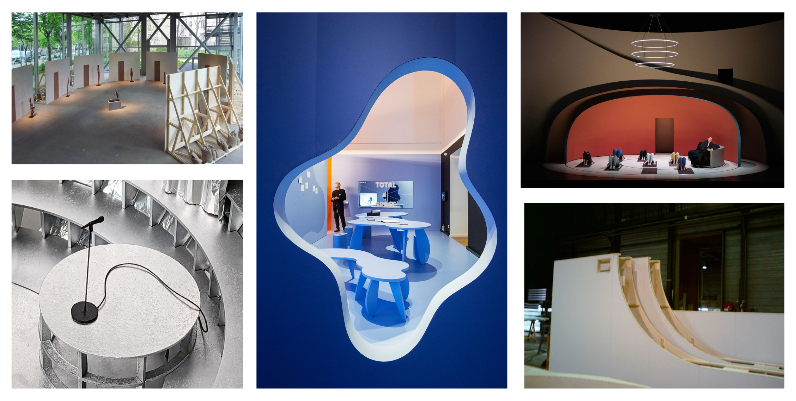

# 2023-12-20 Process

Today I worked on the 3D Design of the product as well as organized sound equipment for january.

## Discussion with Laure about 3D Model

New inputs and references on how I can go for a warmer and more rounded form for the structure.

## Sound Equipment

Asked for sound equipment in pool image son. Difficult situation as there are jury presentations at the same time in January.

I reserved the following items in de magasin audiovisuel:

* 3 Fostex Speakers starting from the 10th of January
* Cameras (either sony pxw z150 or canon 5D Mark IV) starting from 16th of January for Documentation + Canon 16 -35mm lens

Speaker stands still unclear

For the sound cards I might combine two sound cards from Media Design. Have to test how well that works. 