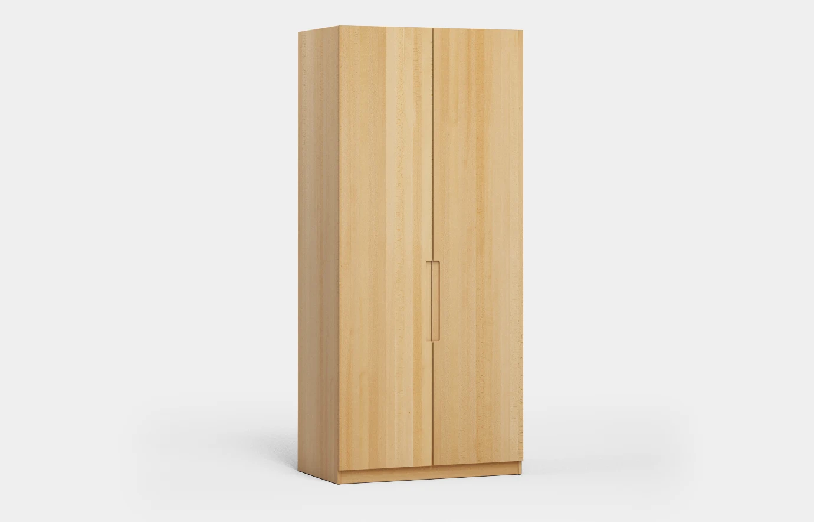
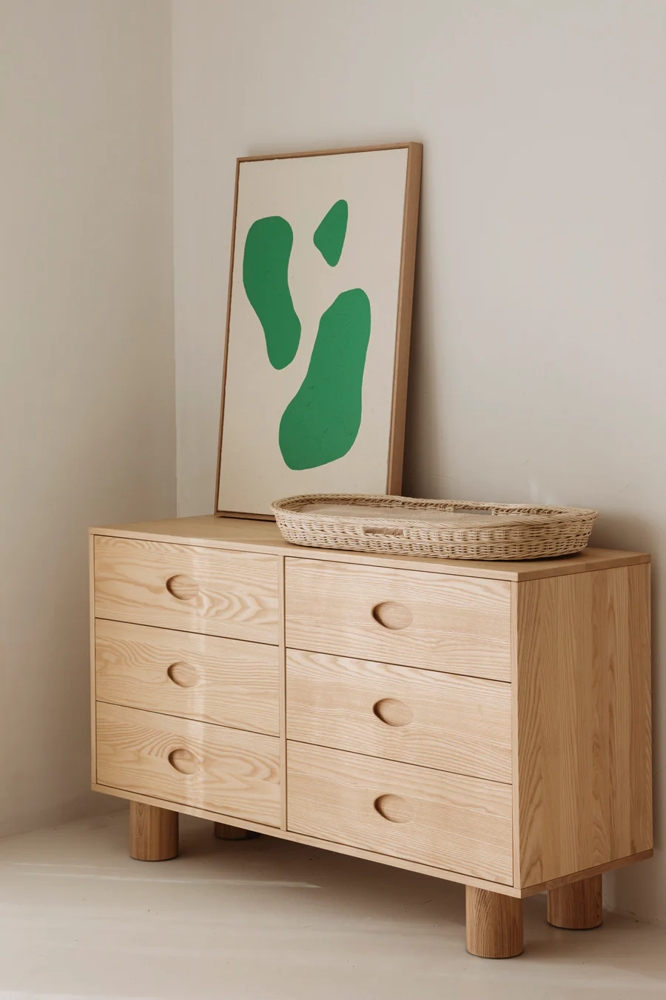

# 2024-01-08 / 09 Process

Morning Appointment with Frederic in the atelier prototypage for the CNC. He will be able to produce the object but unfortunately only short before the presentations.

## CNC Specifications

- 4cm maximum piece height
- 4cm means a minimum radius of 3mm when doing concave edges
- I will have to cut my object into pieces, as the CNC only works on 3 axis
- 12mm distance between objects, 5mm to the edges
- Max working area 1000mm x 500mm

- one round drilling tool and one flat tool
- if its only on the surface its possible to work with thinner tools

## Work

3D Modeling & Troubleshooting with Laure

Wood workshop organizing

Wall projection test

## Wood Choices

Volume for CNC: 412mm x 824mm x 43mm = 1'4597'984 mm3 = 0,014 598 m3

**Wood Options**

| French                                                 | German     | English  | Hardness | Price m3 | Object Price |
| ------------------------------------------------------ | ---------- | -------- | -------- | -------- | ------------ |
| Epicéa | Fichte     | Spruce   | Soft     | 1782     | 26 CHF       |
| ~~Pin~~                                                | ~~Kiefer~~ | ~~Pine~~ | Soft     |          |              |
| Hêtre                                                  | Buche      | Beech    | Hard     | 2558     | 37.35 CHF    |
| Erable                                                 | Ahorn      | Maple    | Hard     | 3218     | 46.97 CHF    |
| **Frêne**                                              | Esche      | Ash      | Hard     | 2558     | 37.35 CHF    |
| Chêne                                                  | Eiche      | Oak      | Hard     | 3713     | 54.20 CHF    |

**Hêtre - Beechwod**

**Frêne - Ashwood**

After some comparison I decided to go with ashwood (beechwood as a backup If they dont have enough) Together with beechwood its the cheapest of the hard wood and has a nicer look and better stability than spruce wood.

